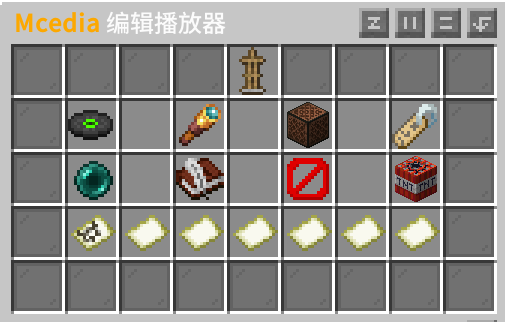

# McediaGUI

Minecraft 视频播放器插件，支持 B站/抖音/直链视频播放。

## 使用方法

1. `/mcedia create <名称>` 创建播放器
2. **蹲下 + 空手右键** 播放器打开编辑界面
3. 设置视频链接，调整参数

## 编辑界面

| 功能 | 说明 |
|------|------|
| 设置视频 | 输入视频链接 |
| 显示配置 | 缩放、位置偏移 |
| 音频配置 | 音量、可听范围 |
| 标签配置 | 循环(左键)、弹幕(右键) |
| 模板 | 保存/应用配置模板(最多7个) |

## 命令

| 命令 | 权限 |
|------|------|
| `/mcedia create <名称>` | `mcedia.create` |
| `/mcedia list` | `mcedia.admin` |
| `/mcedia delete <名称>` | `mcedia.delete` |
| `/mcedia gui` | `mcedia.admin` |
| `/mcedia reload` | `mcedia.reload` |

## 权限

- `mcedia.use` - 蹲下右键编辑 (默认所有人)
- `mcedia.admin` - 管理功能 (默认OP)
- `mcedia.create` / `mcedia.delete` / `mcedia.reload` (默认OP)

## 支持平台

- 哔哩哔哩 (视频/直播/番剧)
- 抖音
- 樱花动漫
- 直链视频

## 配置

`plugins/McediaGUI/config.yml`

## 依赖

- Paper 1.20.4+ / Folia
- Java 17+

## 反馈

- GitHub Issues: https://github.com/Cherry7593/McediaGUI/issues
- QQ: 348913197

## 作者

Zvbj
